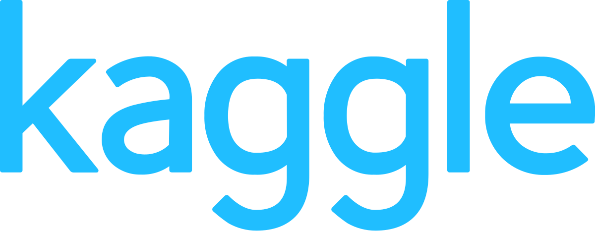

<br/><br/>

<p align="center">
  <a href="https://www.kaggle.com/">
      
  </a>
</p>
</p>

<br/><br/>


KAGGLE PROJECT - World Bank Dataset
==================================

<br/>

# Description

This is the code repository for **World Bank Dataset**, a [Kaggle](https://www.kaggle.com/c/world-bank-dataset) project.

**Link**: https://www.kaggle.com/datasets/bhadramohit/world-bank-dataset/data

<br/>

# Requirements
- Snakemake v7.30.1 and dependencies

<br/>

# How to run
1. Download the github repository
2. Activate your snakemake environment
3. Run the following command
```
cd kaggle__World_Bank_Dataset/workflow
snakemake --profile profiles/local -c1
```

<br/>


# Outputs
This command will run the workflow locally. The results will be stored in the folder `worflow/results`. In this folder, you will find the following files:

- `summary` folder: contains summary tables and figures
- `report.html`: An automated report generated with RMarkdown (click <a href="workflow/results/report.html"> here</a> to read the report)


